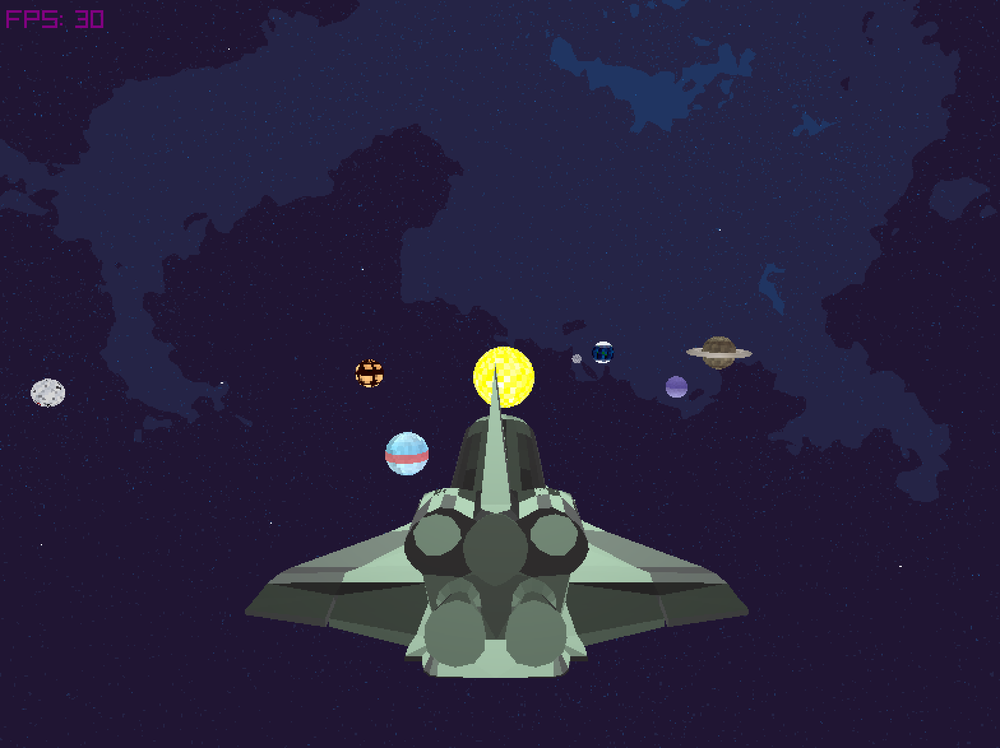
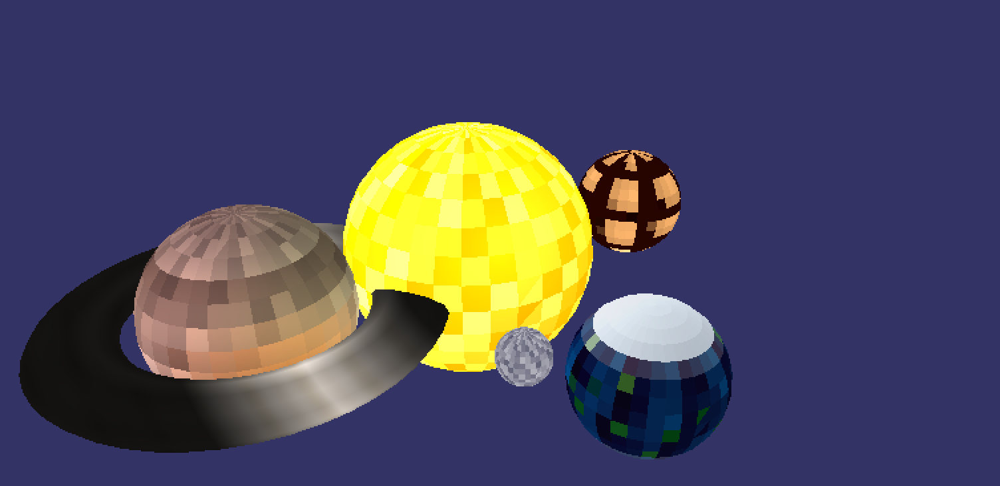
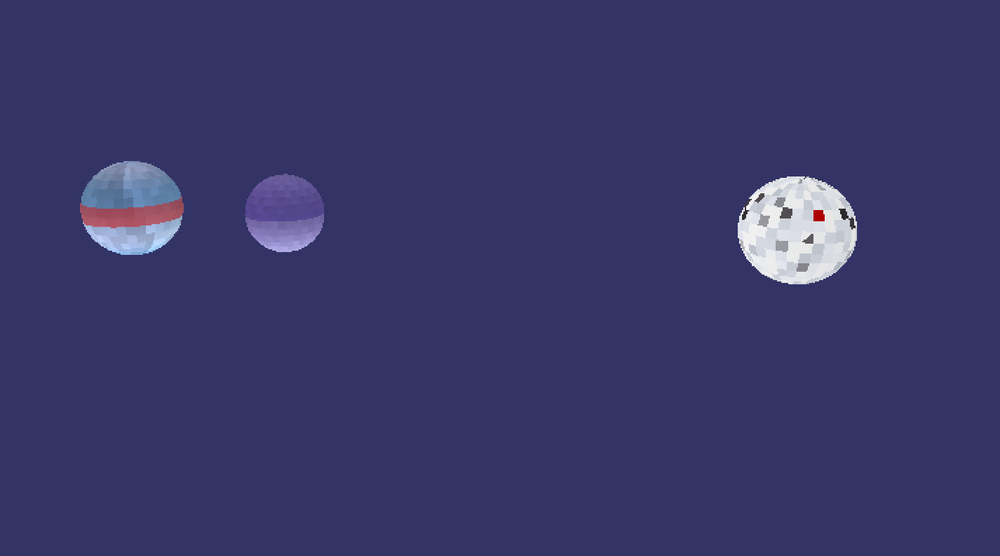
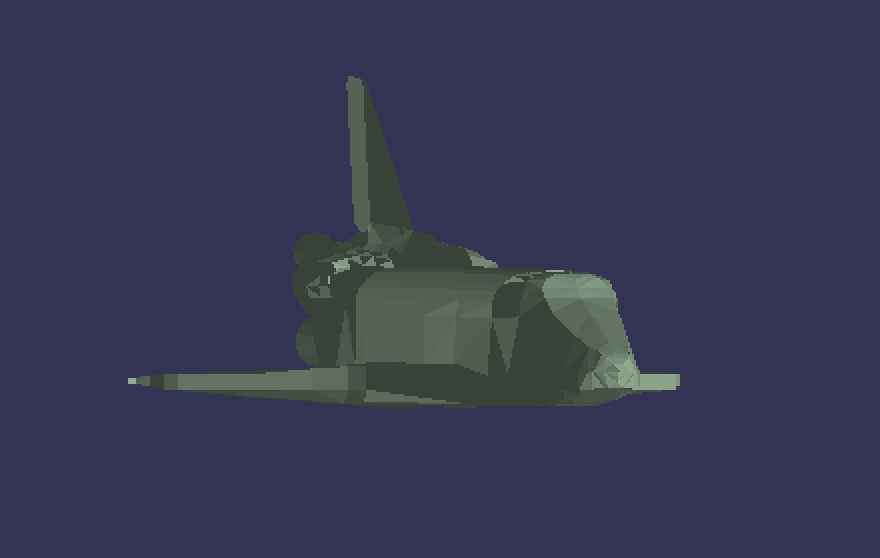
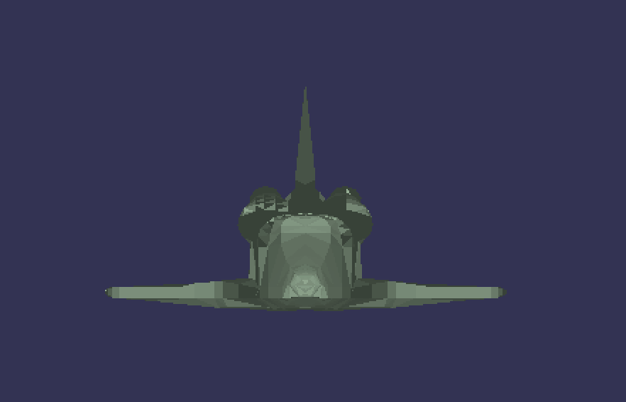

# Solar System Renderer

## Cherry Way Galaxy
A computer graphics project that renders a solar system scene with various planets and a shuttle using a custom shader pipeline. The project features a skybox, dynamic lighting, and detailed models of planets and a shuttle.

*Figure: Cherry Way Galaxy rendering.*

## YouTube Video
[Watch the video](https://youtu.be/-O6avoLTh8c)

## Planets
1. **Rocky Planet 1**
   - A terrestrial planet with a mix of snow and lava surfaces.
2. **Rocky Planet 2**
   - A rocky planet with distinct hot and cold regions
3. **Gas Giant 1**
    - A large gas giant with swirling cloud patterns and gas spot and rings
4. **Gas Giant 2**
    - A gas giant resembling Uranus
5. **Gas Giant 3**
    - A cyan and red-banded gas giant
6. **Earth**
   - A detailed model of Earth with continents, oceans, and cloud cover
7. **Moon**
   - A realistic lunar surface with craters and varying terrain
8. **Sun**
   - A bright, glowing sun with dynamic lighting effects

*Figure: Planets rendering.*

## The Centurion Shuttle

*Figure: The Centurion Shuttle.*